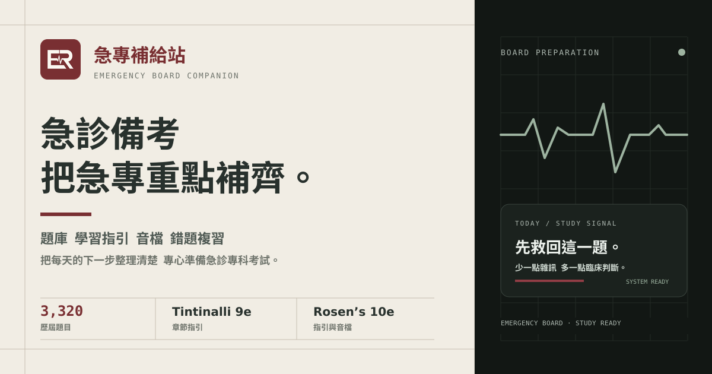
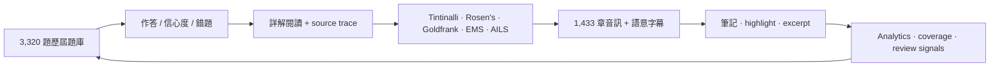
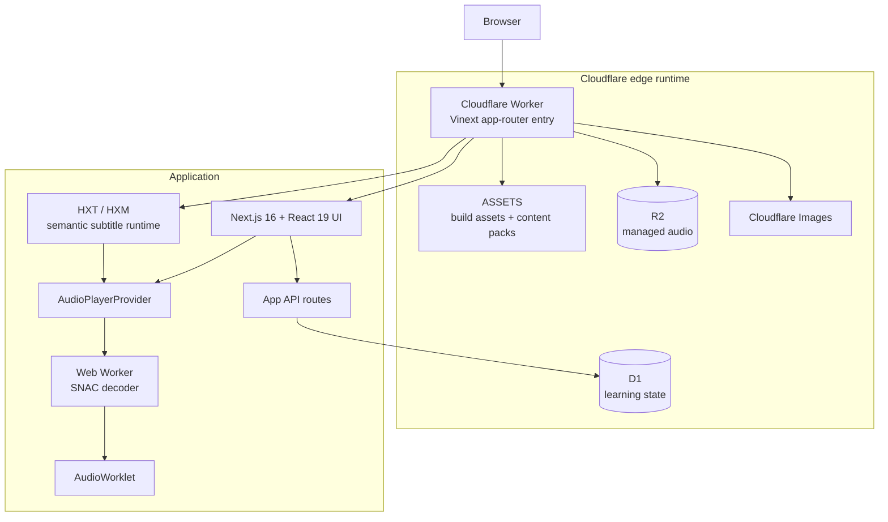
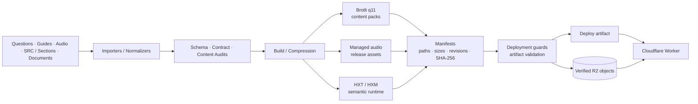

<div align="center">


# 急專補給站

### EM Board Exam · Emergency Medicine Board Preparation & Continuous Learning

**不是只有題庫。**  
把歷屆考題、教科書指引、詳解、筆記、學習分析、文件、音訊、語意字幕與甄審準備整合到同一套 runtime 的急診醫學學習平台。

[](https://emergency-board-questions.jerry3627613.chatgpt.site)
[](./docs/)
[](./docs/ASSET_INVENTORY_V1.json)


[](./docs/ASSET_INVENTORY_V1.json)
[](./docs/ASSET_INVENTORY_V1.json)
[](./docs/ASSET_INVENTORY_V1.json)
[](./docs/ASSET_INVENTORY_V1.json)

[](./package.json)
[](./package.json)
[](./package.json)
[](./package.json)

<a href="https://emergency-board-questions.jerry3627613.chatgpt.site">
  
</a>

**[開啟網站](https://emergency-board-questions.jerry3627613.chatgpt.site)** ·
**[產品能力](#產品能力)** ·
**[內容規模](#verified-content-corpus)** ·
**[系統架構](#系統架構)** ·
**[開發與驗證](#開發與驗證)**

</div>

---

## 專案定位

**急專補給站（EM Board Exam）** 是以台灣急診專科醫師考試準備與持續學習為核心的完整 Web 平台。

Repository 不只保存題目資料，而是保存一套可重建、可驗證、可部署的學習系統：React / Next.js 應用程式、題庫與教材資料、學習指引、音訊與瀏覽器端解碼 runtime、語意字幕、個人學習狀態、資料匯入與壓縮 pipeline、Cloudflare Worker、D1 / R2 整合，以及對應的 contract tests、content audits 與 artifact validation。

> [!NOTE]
> 本專案是考試準備與醫學教育工具；內容不取代臨床判斷、院內流程或最新正式醫療指引。

### 從一道題目到完整學習循環



---

## 產品能力

| Workspace / capability | 目前功能 |
| --- | --- |
| **歷屆題庫** | 民國 94–115 年（2005–2026）共 3,320 題；瀏覽、搜尋、分類、作答與詳解。 |
| **練習與複習** | 作答紀錄、首次正確率、confidence、錯題狀態、收藏、稍後閱讀與複習流程。 |
| **詳解與 trace** | 題目詳解、多閱讀深度、題目 ↔ 教材 / Section / learning map 雙向追溯與 deep link。 |
| **學習指引** | Tintinalli、Rosen’s、Goldfrank、EMS、AILS 與歷屆考題學習地圖共用 reader infrastructure。 |
| **學習音訊** | 1,433 章、SNAC browser runtime、共用播放器、續播、playlist、來源預抓與 section-aware companion。 |
| **語意字幕** | HXT / HXM runtime，保存文字、1 ms timing、A/B speaker、section cue indexes 與 locale titles。 |
| **筆記系統** | question note、highlight、excerpt、原文 anchor、annotation migration 與「回到原文」deep link。 |
| **學習分析** | 完成度、首次 / 近期正確率、confidence、考點 treemap、Section coverage、activity heatmap 等。 |
| **學習文件** | PDF / Office 文件路由、PDF.js preview、獨立 lazy-loaded document workspace。 |
| **備考中心** | 個人資格進度、近期課程、REMOC、認列時數、甄審文件、證明附件與完成紀錄。 |
| **Global Spotlight** | `⌘ K` / `Ctrl K` 全站搜尋與導覽，串接題目、教材、筆記、音訊、文件與主要 workspace。 |
| **Display modes** | Light / Dark / OLED Black 三種顯示模式；首次載入依系統偏好選擇並保存使用者設定。 |
| **Standalone web app** | 提供 `site.webmanifest`、maskable icon、standalone display 與 mobile web-app metadata。 |

---

## Verified content corpus

README 中容易過期的資產數字，優先由 [`docs/ASSET_INVENTORY_V1.json`](./docs/ASSET_INVENTORY_V1.json) 與 repository contracts 作為 source of truth；上方多個 Shields badges 也直接讀取同一份 JSON，因此 inventory 更新後可同步更新顯示值。

### Core corpus

| Corpus | 規模 |
| --- | ---: |
| 急診專科歷屆題庫 | **3,320 題** |
| 年度範圍 | **民國 94–115 年（2005–2026）** |
| Tintinalli’s Emergency Medicine, 9e | **303 chapters / 26 Sections** |
| Rosen’s Emergency Medicine, 10e | **208 chapters / 27 Sections** |
| Goldfrank’s Toxicologic Emergencies, 11e | **140 chapters** |
| 急診住院醫師緊急醫療救護教科書（EMS） | **24 chapters** |
| AILS 急性中毒救命術，第 3 版 | guide + **272 題**獨立練習題庫 |
| 學習音訊 | **1,433 chapters** |

### Runtime assets

| Asset family | Version 1 |
| --- | ---: |
| Managed audio assets | **2,875** |
| Semantic subtitle pairs | **1,433** |
| HXM timing / speaker / section sidecars | **1,433** |
| HXT subtitle text bundles | **74** |
| Section-title locale pairs | **1,433** |
| Packed logical files | **6,525** |
| └ data | 3,374 |
| └ guides | 3,076 |
| └ subtitles-runtime | 75 |
| SNAC data | **173,665,746 bytes** |

Baseline evidence:

- [`docs/ASSET_INVENTORY_V1.json`](./docs/ASSET_INVENTORY_V1.json) — machine-readable asset inventory
- [`docs/FILE_MANIFEST_V1.sha256`](./docs/FILE_MANIFEST_V1.sha256) — complete SHA-256 file manifest
- [`docs/VERSION_1_BASELINE.md`](./docs/VERSION_1_BASELINE.md) — Version 1 baseline and handoff notes

---

## 學習分析

Analytics workspace 不是單一「答對率」圖表，而是直接從 question index、canonical concepts、progress records 與 attempts 計算學習狀態。

| Signal | Example |
| --- | --- |
| Coverage | 已作答 canonical concepts / 全題庫 concepts |
| Accuracy | 首次作答正確率、最近 50 次計分作答正確率 |
| Confidence | low / normal / high confidence 分層表現 |
| Review priority | 高信心但答錯、待複習、錯題狀態 |
| Blueprint | 各領域題量、coverage、error rate、歷屆考點 treemap |
| Cross-domain | Section coverage 與跨領域 overlap |
| Activity | 7-day activity + 28-day heatmap |
| Archive progress | 各年度 / A-B 卷完成度與正確率 |
| Reading state | 已讀、稍後閱讀、收藏與 pending wrong |

---

## 系統架構



### Content production → deployment



內容生產與 runtime delivery 刻意分離：**production assets 先通過可重現的 validation / packaging gates，再由 runtime 以快速且可降級的方式交付。**

---

## Engineering highlights

### R2-first, verified managed audio

Cloudflare Worker 對 managed audio 採 **R2-first / static-fallback**。R2 object 只有在 namespace、custom metadata、stored bytes 與 SHA-256 全部符合 generated allowlist 時才會被接受；若遠端 object 缺失或驗證失敗，runtime 仍可回退到部署 artifact 內的已封裝資產。

Delivery path 同時處理：

- Brotli content negotiation
- SHA-derived ETag
- immutable cache policy
- optional edge cache
- `GET` / `HEAD`
- strict path classification
- controlled seed / verify operator routes

### Hash-bound semantic subtitle runtime

網站部署不把逐 cue timestamp JSON 當 primary subtitle payload。production runtime 使用可逆的 **HXT2 + HXM2** 配對：

- **HXT2** — UTF-8 cue text、header 與 section titles；以多章 Brotli q11 bundle 交付
- **HXM2** — 1 ms durations、sparse gaps、A/B runs、checkpoints 與 section cue indexes
- source / section / HXT / HXM SHA-256 bindings + CRC / structural checks
- one HXM sidecar per chapter，將單章 timing 修正的 cache invalidation 範圍限制在該章
- section boundaries 由 cue indexes 與同一條無損 timeline 推導，不重複保存 timestamp JSON

固定快照 benchmark 曾以 **1,372 組 exact pairs** 驗證：cue-only section boundaries 為 **45,938 bytes**，重複 timestamp JSON 為 **1,506,338 bytes**，同時維持 canonical-byte、section partition 與 **1 ms timing round-trip**。

### Render-first performance

大型醫學 corpus 不應阻塞第一屏。現行 performance architecture 將 route shell、內容 pack、全文搜尋、PDF runtime 與 audio decoder 分開載入：

- Dashboard eager；其他主要 views 採 dynamic import
- planning index 與完整 question index 分離
- Markdown reader、搜尋資料與 PDF runtime 按需載入
- 約 52 MB Brotli 的 SNAC decoder 不進一般首頁 / 普通題庫流程
- eligible audio routes 才在首屏完成後進行 `900 ms + idle` decoder warmup
- warmup / predecode 受 visibility、Save-Data、network、CPU、WebGPU 與 memory capability guards 限制
- 預解碼維持 bounded window，不預解整章
- route transition 為 progressive enhancement，並尊重 reduced motion

<details>
<summary><strong>Performance baseline snapshot</strong></summary>

| Payload / subsystem | Baseline | Loading strategy |
| --- | --- | --- |
| SNAC decoder runtime / model | ~76.97 MB raw / ~51.87 MB Brotli q11 | eligible audio routes only; capability-gated idle warmup |
| Full question index | ~1.58 MB raw / ~243 KB stored | idle after first paint; deferred on slow / Save-Data connections |
| Startup planning index | ~351 KB raw / ~17 KB stored | first-screen planning path |
| Search catalog | ~2.07 MB raw / ~498 KB stored | lazy load when search is needed |
| PDF.js worker | ~1.31 MB raw / ~390 KB gzip | only in learning-documents workspace |
| PDF viewer | ~483 KB raw / ~144 KB gzip | route-local lazy load |

The baseline is intentionally documented as a snapshot; new content or build changes should be measured again instead of treating historical numbers as permanent performance claims.

</details>

### Packed static content

Version 1 將 **6,525 個 logical files** 映射進 content packs。runtime 仍以 logical path 存取；build / audit 則驗證 pack index、offset、length、UTF-8 / JSON 還原與壓縮 artifact，避免把數千個未壓縮資料檔直接作為 production payload。

### Learning state is a real data model

D1 / Drizzle schema 不只記「答對 / 答錯」。目前資料模型包含：

| State family | Examples |
| --- | --- |
| Question progress | attempts、first-attempt correctness、confidence、bookmark、read / wrong state、streak、due time |
| Attempt log | selected answers、mode、confidence、mutation identity、generation |
| Annotations | note / highlight / excerpt、quote anchors、revision、soft delete |
| Guide progress | read state、bookmark、content hash、last-opened / completed timestamps |
| Audio playlists | playlist items、revision、soft delete |
| Board prep | profile、course completion、evidence metadata / SHA-256、cleanup state |
| Identity migration | legacy → stable user identity mapping |

---

## 驗證與可靠性

這個 repository 把「可以 build」與「內容可證明地正確交付」視為不同層次。

`npm test` 會先建立 production build，再執行 expanded tests 與 compressed-content audit。repository 內可見的測試 / 稽核涵蓋：

- question-bank coverage 與 archive range
- answer selection
- app routing / deep links
- account sync contracts
- annotation lifecycle / migration / source anchors
- AILS guide contracts
- audio chapter packages
- audio library workspace
- player dock / section-subtitle contracts
- playlists
- semantic audio / subtitle package behavior
- Markdown content audits
- explanation packs
- board-textbook runtime
- compressed static content
- audio runtime / built R2 and SNAC routes
- final artifact validation

### Validation commands

```bash
# Production build
npm run build

# TypeScript
npx tsc --noEmit

# Lint
npm run lint

# Full build + test + content audit chain
npm test

# Final deployable artifact checks
npm run validate:artifact
```

---

## 技術棧

| Layer | Technology |
| --- | --- |
| Application | **Next.js 16.2**, **React 19.2**, **TypeScript 5.9** |
| Build / runtime | **Vite 8**, **Vinext**, Node.js `>=22.13.0` |
| Edge | **Cloudflare Worker**, Wrangler |
| Data | **Cloudflare D1**, **Drizzle ORM** |
| Managed media | **Cloudflare R2**, Brotli, SHA-256 manifests |
| Content rendering | React Markdown, GFM, KaTeX, PDF.js |
| Audio | SNAC browser runtime, Web Worker, AudioWorklet |
| Styling | Project CSS system + Tailwind CSS toolchain |
| Validation | Node test runner, contract tests, content audits, artifact validation |

---

## 開發與驗證

### Requirements

- Node.js `>=22.13.0`
- npm
- Linux 環境建議具備 `flock`、`curl` 與 GNU `timeout`

### Local development

```bash
git clone https://github.com/jerry0327/ER-board-exam.git
cd ER-board-exam
npm ci
npm run dev
```

### Production build

```bash
npm run build
```

`main` 是可直接交接的正式基準。功能或內容修改應建立 branch，完成 typecheck、相關 tests、build 與必要 asset audits 後再合併。

---

## Repository anatomy

```text
app/                            Web UI、views、components、hooks 與應用程式邏輯
app/api/                        progress、annotations、playlists、board-prep 等 API routes
app/lib/                        domain logic、routing、audio、annotation、search 與 learning state
public/data/                    題庫與結構化 runtime 資料
public/content-packs/           壓縮後的 data / guides / subtitle content packs
public/audio/                   SNAC 與 managed-audio assets
public/subtitles-runtime/       HXT/HXM subtitle + section runtime
public/subtitles-title-locales/ section-title locale assets
public/learning-documents/      learning-document runtime
db/ + drizzle/                  D1 / Drizzle schema 與 migration assets
worker/                         Cloudflare Worker、R2/static delivery 與 cache policy
scripts/                        import、build、compress、audit、guard 與維運工具
tests/                          contract / runtime / integration / content tests
build/                          Vite / Sites build helpers
docs/                           architecture、codec、performance 與 baseline documents
```

---

## Architecture & maintenance docs

| Document | Purpose |
| --- | --- |
| [`docs/audio-architecture.md`](./docs/audio-architecture.md) | SNAC、player、R2、managed audio 與 warmup pipeline |
| [`docs/semantic-subtitle-runtime.md`](./docs/semantic-subtitle-runtime.md) | HXT / HXM runtime format、integrity 與 deployment gates |
| [`docs/subtitle-production-and-deployment.md`](./docs/subtitle-production-and-deployment.md) | subtitle / Section production、codec 與 deployment workflow |
| [`docs/performance-architecture.md`](./docs/performance-architecture.md) | render-first、lazy loading、decoder warmup 與 performance acceptance |
| [`docs/static-content-performance.md`](./docs/static-content-performance.md) | static content / pack performance notes |
| [`docs/ASSET_INVENTORY_V1.json`](./docs/ASSET_INVENTORY_V1.json) | Version 1 machine-readable asset inventory |
| [`docs/FILE_MANIFEST_V1.sha256`](./docs/FILE_MANIFEST_V1.sha256) | complete file integrity manifest |
| [`docs/VERSION_1_BASELINE.md`](./docs/VERSION_1_BASELINE.md) | canonical Version 1 baseline |

<details>
<summary><strong>常用內容 / 音訊維運指令</strong></summary>

```bash
# Audio
npm run import:snac-library
npm run compress:snac-audio
npm run audit:audio-runtime

# Subtitle runtime
npm run import:subtitle-runtime-semantic
npm run import:section-title-locales
npm run guard:subtitle-deployment

# Questions / guides
npm run build:question-data
npm run build:study-guide-data
npm run audit:markdown
npm run audit:explanation-packs

# Artifact validation
npm run validate:artifact
```

詳細前置條件與資料契約請依 [`docs/`](./docs/) 內對應文件執行；不要只依單一 script 名稱推測整條 production pipeline。

</details>

---

<div align="center">

**急專補給站 · Emergency Board Companion**

[開啟網站](https://emergency-board-questions.jerry3627613.chatgpt.site) ·
[查看架構文件](./docs/) ·
[Asset inventory](./docs/ASSET_INVENTORY_V1.json) ·
[Version 1 baseline](./docs/VERSION_1_BASELINE.md)

</div>
