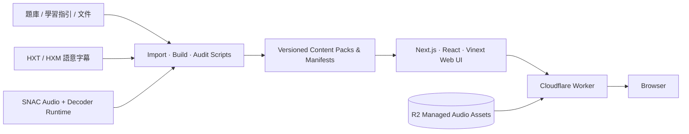

<div align="center">


# 急專補給站

**EM Board Exam · Emergency Medicine Board Preparation & Continuous Learning**

整合台灣急診專科歷屆題庫、學習指引、音訊、語意字幕、詳解與複習工具的 Web 學習平台。

[](https://emergency-board-questions.jerry3627613.chatgpt.site)
[](./docs/)


<a href="https://emergency-board-questions.jerry3627613.chatgpt.site">
  
</a>

</div>

---

## 專案定位

**急專補給站（EM Board Exam）** 是一套以急診專科考試準備與持續學習為核心的 Web 平台。Repository 保存可重建網站所需的應用程式原始碼、題庫與結構化資料、學習指引、音訊、字幕／section runtime、文件、測試、資料匯入與維運工具；`main` 作為正式開發基準。

平台目前涵蓋歷屆題庫作答與瀏覽、題目詳解、錯題複習、學習進度與分析、教科書／專題學習指引、學習文件，以及具語意 section 資料的音訊播放流程。

> [!NOTE]
> 本專案定位為考試準備與學習工具。內容用於教育與複習，不取代臨床判斷、院內流程或最新正式醫療指引。

## 內容規模

| 資產 | 目前規模 |
| --- | ---: |
| 急診專科歷屆題庫 | **3,320 題** |
| 題庫年度範圍 | **ROC 94–115B（2005–2026）** |
| 學習音訊章節 | **1,433** |
| Managed audio assets | **2,875** |
| 語意字幕 pairs | **1,433** |
| HXM timing / speaker / section sidecars | **1,433** |
| HXT 字幕文字 bundles | **74** |
| Section title locale pairs | **1,433** |
| Packed logical files | **6,525** |

完整且可機器驗證的資產統計請見 [`docs/ASSET_INVENTORY_V1.json`](./docs/ASSET_INVENTORY_V1.json)；Version 1 基準說明見 [`docs/VERSION_1_BASELINE.md`](./docs/VERSION_1_BASELINE.md)。

## 核心功能

| 模組 | 內容 |
| --- | --- |
| **歷屆題庫** | ROC 94–115B 題目瀏覽與作答、詳解閱讀、錯題與複習流程。 |
| **學習指引** | Tintinalli’s 9e、Rosen’s 10e、Goldfrank’s 11e、EMS、AILS 與歷屆考題學習地圖等內容入口。 |
| **學習音訊** | 1,433 個章節；SNAC 音訊資料、瀏覽器端 decoder runtime、共用播放器與續播流程。 |
| **語意字幕** | HXT/HXM runtime，保存文字、時間、speaker、section 與 section title locale 等結構化資訊。 |
| **進度與分析** | Dashboard、學習進度、作答／複習資料與 analytics view。 |
| **學習文件** | 文件瀏覽與 PDF.js reader，與其他學習資源維持獨立 lazy-load 流程。 |
| **內容維運** | 題庫、學習指引、音訊、字幕與靜態 content packs 的匯入、壓縮、稽核與部署工具。 |

### 主要學習內容

- **Tintinalli’s Emergency Medicine, 9th Edition** — 303 chapters / 26 sections
- **Rosen’s Emergency Medicine, 10th Edition** — 208 chapters / 27 sections
- **Goldfrank’s Toxicologic Emergencies, 11th Edition** — 140 chapters
- **急診住院醫師緊急醫療救護教科書（EMS）** — 24 chapters
- **AILS 急性中毒救命術，第 3 版** — 複習內容與題目練習
- **歷屆考題學習地圖** — 以考題主題與單元串接題庫複習

## 系統架構



音訊正式環境採 **R2-first / static-fallback** 的受控資產流程；Worker 僅服務 allowlist 中且 metadata、大小與 SHA-256 符合 manifest 的物件。字幕則以 HXT/HXM 與 section locale 等結構化 runtime 提供搜尋、索引、同步與播放器 section 呈現所需資料。

深入文件：

- [`docs/audio-architecture.md`](./docs/audio-architecture.md) — 音訊、SNAC、R2 與播放器架構
- [`docs/semantic-subtitle-runtime.md`](./docs/semantic-subtitle-runtime.md) — 語意字幕 runtime 格式
- [`docs/subtitle-production-and-deployment.md`](./docs/subtitle-production-and-deployment.md) — 字幕資料製作與部署
- [`docs/performance-architecture.md`](./docs/performance-architecture.md) — render-first、lazy loading 與效能策略
- [`docs/static-content-performance.md`](./docs/static-content-performance.md) — 靜態內容效能

## 技術棧

| Layer | Technology |
| --- | --- |
| Application | **Next.js 16.2**, **React 19.2**, **TypeScript 5.9** |
| Build / runtime | **Vite 8**, **Vinext**, Node.js `>=22.13.0` |
| Edge | **Cloudflare Worker**, Wrangler |
| Data | **Drizzle ORM** |
| Content rendering | React Markdown, GFM, KaTeX, PDF.js |
| Audio | SNAC browser runtime, Web Worker, AudioWorklet, managed R2 assets |
| Styling | Project CSS system + Tailwind CSS toolchain |
| Validation | Node test runner, content audits, artifact validation, SHA-256 manifests |

## Quick start

### Requirements

- Node.js `>=22.13.0`
- npm
- Linux 環境建議具備 `flock`、`curl` 與 GNU `timeout`

### Development

```bash
git clone https://github.com/jerry0327/ER-board-exam.git
cd ER-board-exam
npm ci
npm run dev
```

### Build & validation

```bash
# Production build
npm run build

# TypeScript
npx tsc --noEmit

# Lint
npm run lint

# Full test / content audit chain
npm test
```

`npm test` 會先建立正式產物，再執行 repository 內的 contract、runtime、Markdown、explanation pack、board-textbook runtime 與壓縮內容稽核流程。

## Repository layout

```text
app/                            Web UI、views、components 與應用程式邏輯
public/data/                    題庫與結構化 runtime 資料
public/guides/                  學習指引 content packs
public/audio/                   音訊、SNAC 與 managed-audio assets
public/subtitles-runtime/       HXT/HXM 字幕與 section runtime assets
public/subtitles-title-locales/ section title locale assets
public/learning-documents/      學習文件 runtime
scripts/                        匯入、建置、壓縮、稽核與維運工具
tests/                          contract / runtime / integration tests
worker/                         Cloudflare Worker
db/ + drizzle/                  資料層與 schema / migration 資產
build/                          Vite / Sites build helpers
docs/                           架構、資料格式、效能與交班文件
```

## 資料與資產完整性

Version 1 保留可重建的正式基準與完整資產清單。大型內容不是單純以「能載入」作為完成條件，而是透過 manifest、logical path、stored path、大小、revision 與 SHA-256 等欄位維持可驗證性。

重要索引：

- [`docs/ASSET_INVENTORY_V1.json`](./docs/ASSET_INVENTORY_V1.json) — Version 1 資產統計
- [`docs/FILE_MANIFEST_V1.sha256`](./docs/FILE_MANIFEST_V1.sha256) — 全檔 SHA-256 manifest
- [`docs/VERSION_1_BASELINE.md`](./docs/VERSION_1_BASELINE.md) — canonical Version 1 baseline

<details>
<summary><strong>內容／音訊維運指令</strong></summary>

部分常用流程：

```bash
# Audio
npm run import:snac-library
npm run compress:snac-audio
npm run audit:audio-runtime

# Subtitle runtime
npm run import:subtitle-runtime-semantic
npm run import:section-title-locales
npm run guard:subtitle-deployment

# Question / guide data
npm run build:question-data
npm run build:study-guide-data
npm run audit:markdown
npm run audit:explanation-packs

# Artifact validation
npm run validate:artifact
```

詳細前置條件與資料契約請依 [`docs/`](./docs/) 內對應架構文件執行，不建議只依單一 script 名稱推測整條 production pipeline。

</details>

## 開發與版本控制

`main` 是可直接交接的正式基準。功能或內容修改應建立 branch，完成 typecheck、相關 tests、build 與必要的 asset audits 後再合併。

請勿將 `node_modules/`、`.next/`、`.wrangler/`、`.sites-runtime/`、`dist/`、本機輸出、cache 或其他可重建 runtime 納入 Git。

---

<div align="center">

**急專補給站 · Emergency Board Companion**

[開啟網站](https://emergency-board-questions.jerry3627613.chatgpt.site) · [查看架構文件](./docs/) · [Version 1 baseline](./docs/VERSION_1_BASELINE.md)

</div>
